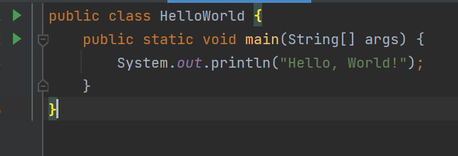
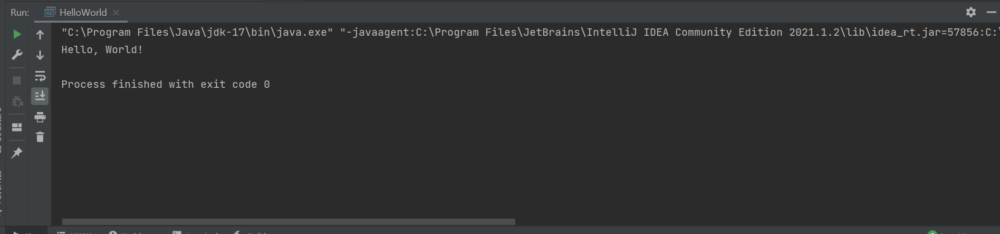

# Setup Instructions

## JDK version used

- JDK: Oracle Java SE 17.0.9 (LTS), HotSpot 64-Bit Server VM
- Build: 17.0.9+11-LTS-201
- OS: Windows
- Project folder: F:\LearnTrack
- IDE: IntelliJ IDEA

Verified in the terminal:

F:\LearnTrack>java -version
java version "17.0.9" 2023-10-17 LTS
Java(TM) SE Runtime Environment (build 17.0.9+11-LTS-201)
Java HotSpot(TM) 64-Bit Server VM (build 17.0.9+11-LTS-201, mixed mode, sharing)

F:\LearnTrack>javac -version
javac 17.0.9

Both commands work, so the JDK (not just the JRE) is installed and on the PATH.

## Hello World

I created `HelloWorld.java`, compiled it with `javac HelloWorld.java`
(this produces `HelloWorld.class`, which is bytecode) and ran it with
`java HelloWorld`. It printed:

    Hello, World!

Code Screenshot : 

Output ScreenShot:
